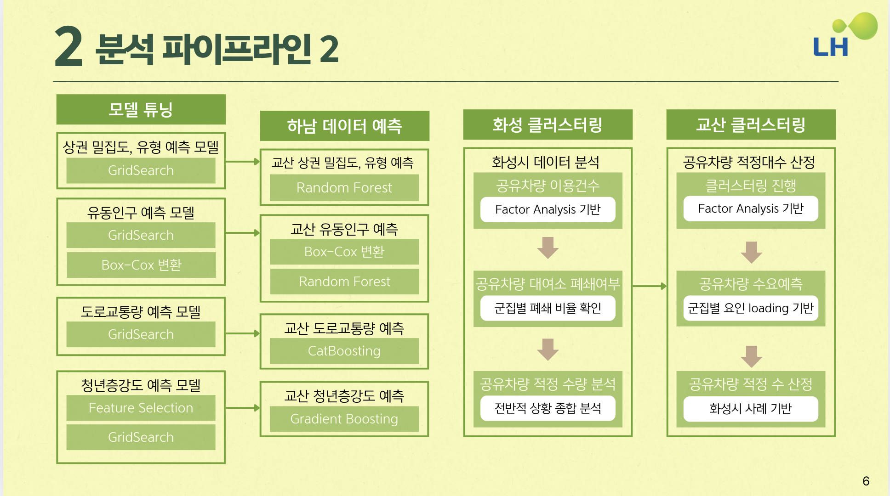

# **LH_COMPAS_COMPETITION**

## **주제 : [LH] 공공주택 공유차량 적정규모 산정 | by COMPAS**
**🏆 최우수상  수상**

---

## 🧑‍🤝‍🧑 **Team Members**
- **팀원** : 김민열(팀장), 김홍재, 정선열, 정호원, 김현정
- **팀명** : LH내꺼

---

## **🌟 Introduction | 대회 소개**
- 화성시의 인구/상권/유동인구/교통/주택정보/공유차량 이용현황 등의 데이터를 활용하여 2028년 준공 예정인 교산 신도시의 공유차량 수요를 예측하는 과제이다.

---

## **📅 Progress Period | 진행 기간**
2024.11.25 ~ 2025.01.03

---

## **🚀 Process | 수행 과정**

- 1. 제공받은 화성시의 데이터를 격자 기준으로 정제하여 데이터셋 구축
- 2. 거주인구 => 청년층 강도 / 상권 => 상권밀집도 /유동인구 => 유동인구 강도 / 도로교통량 => 교통량 예측 모델 생성
- 3. 화성시 데이터 분석과 클러스터링을 통해 현재 공유차량 배치 해석 
- 4. 도시 계획서류를 참고하여 하남 교산시의 기초 데이터(주택 공급, 지하철 등) 생성
- 5. 앞서 구축한 모델로 하남의 청년층 강도/상권밀집도/유동인구 강도/교통량 예측
- 6. 예측한 특징에 대해 화성시와 같은 방식으로 군집을 형성하고 해석하여 최종 규모 산정

---

## **📁 Key Directories and Files | 주요 디렉토리 및 파일**
- `/EDA` : 화성시의 주요 데이터 및 공유차량 이용과의 관계 파악
- `/data_preprocessing` : 모델 구축에 용이하도록 데이터를 정제 및 가공
- `/Modeling` : 화성시의 데이터를 통해 청년층 강도/상권밀집도/유동인구 강도/도로교통량 예측 모델 구축
- `/images` : 이미지 디렉토리 